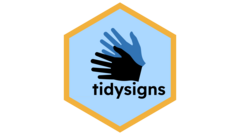

<!-- badges: start -->
# tidysigns 
<!-- badges: end -->

The goal of `tidysigns` is to facilitate getting sign language corpus data directly into R, and in a [tidy format](https://r4ds.hadley.nz/data-tidy#sec-tidy-data). 

For importing data into R, `tidysigns` can read three file formats that are crucial for sign language data: ELAN annotation files (`.eaf`), iLex annotation files (`.ilex`) and CMDI metadata files (`.cmdi`).

In addition to reading different data files, `tidysigns` also has a few functions for processing this data in ways that may be relevant to sign language researchers. For example, child annotations in ELAN (annotations on dependent tiers) are read into a long format, but can be pivoted into a wide format, linked to their parent tier with the function `pivot_children()`. Turns and overlaps in the signing can also be added to a file by dedicated functions: `find_turns()` and `find_overlaps()`.

## Installation

You can install the development version of `tidysigns` like so:

``` r
devtools::install_github("borstell/tidysigns")
```

## Examples


### Reading data files

If you want to read an ELAN or iLex file, you can simply direct the corresponding function to a path or even URL to an individual file, or a path to a directory that contains multiple files of that format.

``` r
library(tidysigns)

elan_data <- read_eaf("/path/to/file.eaf")

ilex_data <- read_ilex("/path/to/file.ilex")
```

Note that if you input a path to a directory potentially containing multiple files, you can choose to search recursively (i.e., including files in subfolders) or only in the exact directory of the path:

``` r
library(tidysigns)

# Read files recursively (default is `TRUE`)
elan_data <- read_eaf("/path/to/elan_files/")

# Read files in exact directory only
elan_data <- read_eaf("/path/to/elan_files/", recursive = FALSE)
```

For ELAN files, you can specify which tiers or tier types you want to search, which speeds up the process of reading multiple files in a directory. The tiers can be specified with a named vector:

``` r
library(tidysigns)

# Read files, but only tiers with tier_type `gloss_DH` or `gloss_NonDH`
elan_data <- read_eaf("/path/to/elan_files/", 
  tiers = c("tier_type" = "gloss_DH", "tier_type" = "gloss_NonDH"))

```

For even more advanced tier selection options, you can specify an XPath for the specific tiers wanted:

``` r
library(tidysigns)

# Read files, but only tiers with names that begin with "CLP"
elan_data <- read_eaf("/path/to/elan_files/", 
  xpath = "[starts-with(@TIER_ID,'CLP')]")

```

### Reading metadata files

Some (sign language) corpora come with metadata files in the CMDI (`.cmdi`) format. The function `read_cmdi()` reads most relevant information about participants (if `meta = "signers"`; default) or the file contents (if `meta = "content"`). Note that the output may include metadata about non-participating individuals, such as moderators or researchers who collected the data, and if multiple files are read, the output may contain partial duplicates (depends on the metadata conventions):

``` r
library(tidysigns)

# Read all CMDI files in a directory (but not recursively) for signer metadata:
metadata_signers <- read_cmdi("/path/to/metadata_files/", recursive = FALSE)

# Read all CMDI files in a directory for file contents metadata:
metadata_content <- read_cmdi("/path/to/metadata_files/", meta = "content")

```


### Modifying/enhancing the data

With the `pivot_children()` function, you can with ELAN data quickly turn a tibble with child annotations into a wide format (and pivot back to a long format if you set `long = TRUE`):

``` r
library(tidysigns)

# Read files, but only tiers with names that begin with "CLP"
elan_data <- read_eaf("/path/to/elan_files/", 
  xpath = "[starts-with(@TIER_ID,'CLP')]") |> 
  pivot_children()

```
... but note that this pivots all child tiers to new columns and may result in `NA` values (also if pivoted back to a long format with `long = TRUE`).

With the `find_overlaps()` function, you input a tibble of data (from either `read_eaf()` or `read_ilex()`) and the output will output a tibble with columns added, indicating whether an annotation overlaps in time with a) any other annotation by the participant (`overlap_self`) and b) any other annotation by _another_ participant (`overlap_other`).


``` r
library(tidysigns)

# Make data for a minimal working example
df <- dplyr::tibble(file = "A",
                    hand = c("dh", "ndh", "dh", "dh", "dh", "dh", "ndh", "dh", "dh"),
                    participant = rep(LETTERS[1:2], c(4, 5)),
                    start = c(100, 200, 1250, 1000, 600, 1000, 1000, 1200, 1400),
                    end = c(300, 1200, 1280, 1200, 800, 1200, 1200, 1300, 1600))

# Visualize self-overlaps (signer's two hands)
df |>
  find_overlaps() |>
  ggplot2::ggplot() +
  ggplot2::geom_errorbarh(
    ggplot2::aes(xmin=start,
                 xmax=end,
                 y = paste0(participant, "_", hand),
                 color=overlap_self),
    linewidth = 1, height = .4) +
  ggplot2::scale_color_brewer(palette = "Accent") +
  ggplot2::labs(y="Signer") +
  ggplot2::theme_minimal()
  
# Visualize overlap across signers
df |>
  find_overlaps() |>
  ggplot2::ggplot() +
  ggplot2::geom_errorbarh(
    ggplot2::aes(xmin=start,
                 xmax=end,
                 y = paste0(participant, "_", hand),
                 color=overlap_other),
    linewidth = 1, height = .4) +
  ggplot2::scale_color_brewer(palette = "Accent") +
  ggplot2::labs(y="Signer") +
  ggplot2::theme_minimal()

```

Overlaps should work also when there is a multi-party interaction (i.e., more than two):

``` r
library(tidysigns)

# Make data for a minimal working example (with a 3-party conversation)
df2 <- dplyr::tibble(file = "A",
                    hand = c("dh", "ndh", "dh", "dh", "dh", "dh", "ndh", "dh", "dh", "ndh"),
                    participant = rep(LETTERS[1:3], c(4, 3, 3)),
                    start = c(100, 200, 1250, 1000, 600, 1000, 1000, 1200, 1400, 1450),
                    end = c(300, 1200, 1280, 1200, 800, 1200, 1200, 1300, 1600, 1550))

# Visualize self-overlaps (signer's two hands)
df2 |>
  find_overlaps() |>
  ggplot2::ggplot() +
  ggplot2::geom_errorbarh(
    ggplot2::aes(xmin=start,
                 xmax=end,
                 y = paste0(participant, "_", hand),
                 color=overlap_self),
    linewidth = 1, height = .4) +
  ggplot2::scale_color_brewer(palette = "Accent") +
  ggplot2::labs(y="Signer") +
  ggplot2::theme_minimal()
  
# Visualize overlap across signers
df2 |>
  find_overlaps() |>
  ggplot2::ggplot() +
  ggplot2::geom_errorbarh(
    ggplot2::aes(xmin=start,
                 xmax=end,
                 y = paste0(participant, "_", hand),
                 color=overlap_self),
    linewidth = 1, height = .4) +
  ggplot2::scale_color_brewer(palette = "Accent") +
  ggplot2::labs(y="Signer") +
  ggplot2::theme_minimal()

```

The `find_turns()` function infers turns either strictly _sequential_ (`method = "sequential"`) based on the chronological order of signs, or based on a pause threshold _interval_ (`method = "interval"`), in which case turns are defined by-participant, splitting a turn anytime the gap between two signs is longer than a defined threshold (see also [Börstell 2024](https://doi.org/10.1515/lingvan-2024-0025)). The output is a tibble that if set to `simplify = TRUE` will reduce all "turns" into a single annotation.

``` r
library(tidysigns)

# Read all ELAN files in directory, pivot children and add overlaps and turns
elan_annotations <- read_eaf("/path/to/elan_files/") |> 
  pivot_children() |> 
  find_overlaps() |> 
  find_turns()

```

## Notes

A few notes to be made:

  - A `read_elan()` function was included in my older [`signglossR` package](https://github.com/borstell/signglossR/). The `read_eaf()` function of the `tidysigns` package is faster (and better).
  - Other packages have functions to read ELAN files (`.eaf`), and some of these are faster and more efficient (see, e.g., [`phonfieldwork`](https://github.com/ropensci/phonfieldwork/blob/master/R/eaf_to_df.R)). My main goals with the `tidysigns` package are a) to use `tidyverse` style and functions as much as possible, and b) to add functionality/flexibility that I need for my own research purposes (e.g., specifying target tiers ahead of reading the files).
  - The functions in `tidysigns` have been written with corpus data from mainly STS, NGT and DGS for testing. As such, the testing of all functionality is based on the structure of the corresponding corpora, and may not translate to another corpus if the structure and contents of files look very different.
  - I have very limited experience with the iLex format (`.ilex`), so the `read_ilex()` function was coded with some trial and error on a few test files. However, the [DGS Korpus](https://www.sign-lang.uni-hamburg.de/meinedgs/ling/start-name_en.html) also has annotation files in `.eaf` format.

**Do reach out if you have any praise, comments, questions or suggestions!**
